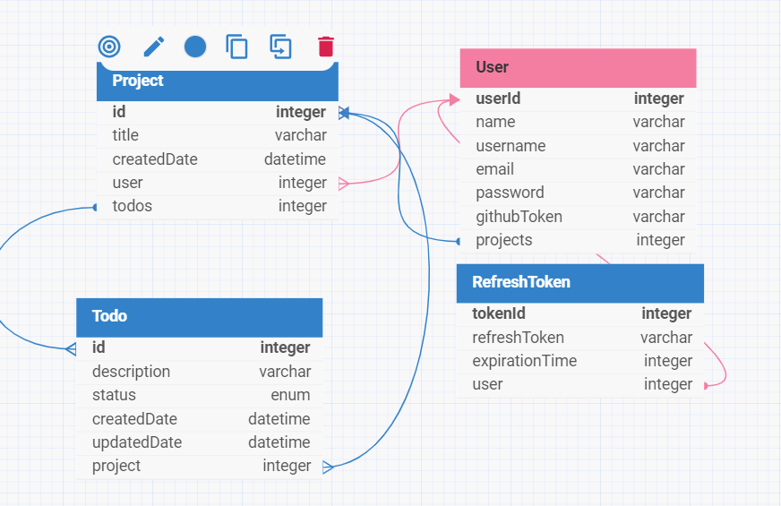

## Project Management Database Schema

This database schema is designed to manage users, projects, and tasks within a project management system. It consists of four main entities: User, Project, Todo, and RefreshToken. Below is an overview of each table and the relationships between them.

Database Structure
## 1. User

   Purpose: Stores information about the users of the system.
   Columns:
   userId (integer): Primary key, unique identifier for each user.
   name (varchar): Name of the user.
   username (varchar): Unique username for login purposes.
   email (varchar): User’s email address.
   password (varchar): Hashed password for user authentication.
   githubToken (varchar): Token used for integrating GitHub, if applicable.
   projects (integer): Links to the projects associated with this user.

## 2. Project
   Purpose: Represents a project created by a user.
   Columns:
   id (integer): Primary key, unique identifier for each project.
   title (varchar): Name of the project.
   createdDate (datetime): Timestamp when the project was created.
   user (integer): Foreign key, references userId in the User table.
   todos (integer): Links to tasks (todos) associated with this project.
## 3. Todo
   Purpose: Represents individual tasks or items within a project.
   Columns:
   id (integer): Primary key, unique identifier for each todo item.
   description (varchar): Description of the task.
   status (enum): Status of the task (e.g., pending, in progress, completed).
   createdDate (datetime): Timestamp when the task was created.
   updatedDate (datetime): Timestamp when the task was last updated.
   project (integer): Foreign key, references id in the Project table.
## 4. RefreshToken
   Purpose: Stores refresh tokens for user authentication sessions.
   Columns:
   tokenId (integer): Primary key, unique identifier for each token.
   refreshToken (varchar): The actual refresh token value.
   expirationTime (integer): Expiration time for the refresh token, typically in seconds or a timestamp.
   user (integer): Foreign key, references userId in the User table.
   Relationships
   User ↔ Project: A user can have multiple projects, creating a one-to-many relationship.
   Project ↔ Todo: A project can have multiple tasks (todos), forming a one-to-many relationship.
   User ↔ RefreshToken: A user can have multiple refresh tokens, establishing a one-to-many relationship for managing user sessions.
   ER Diagram

## This diagram provides a visual representation of the database schema, showing the entities, their attributes, and the relationships between them.

